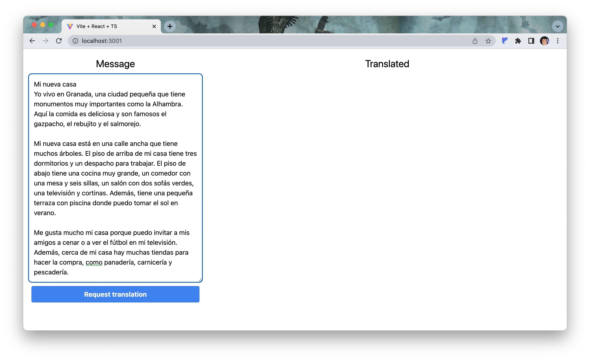
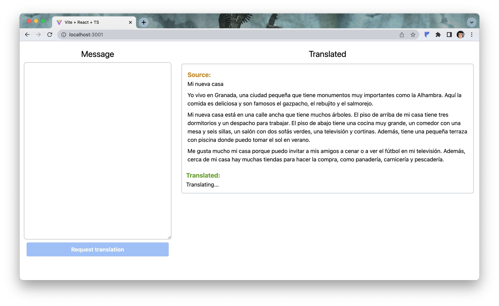
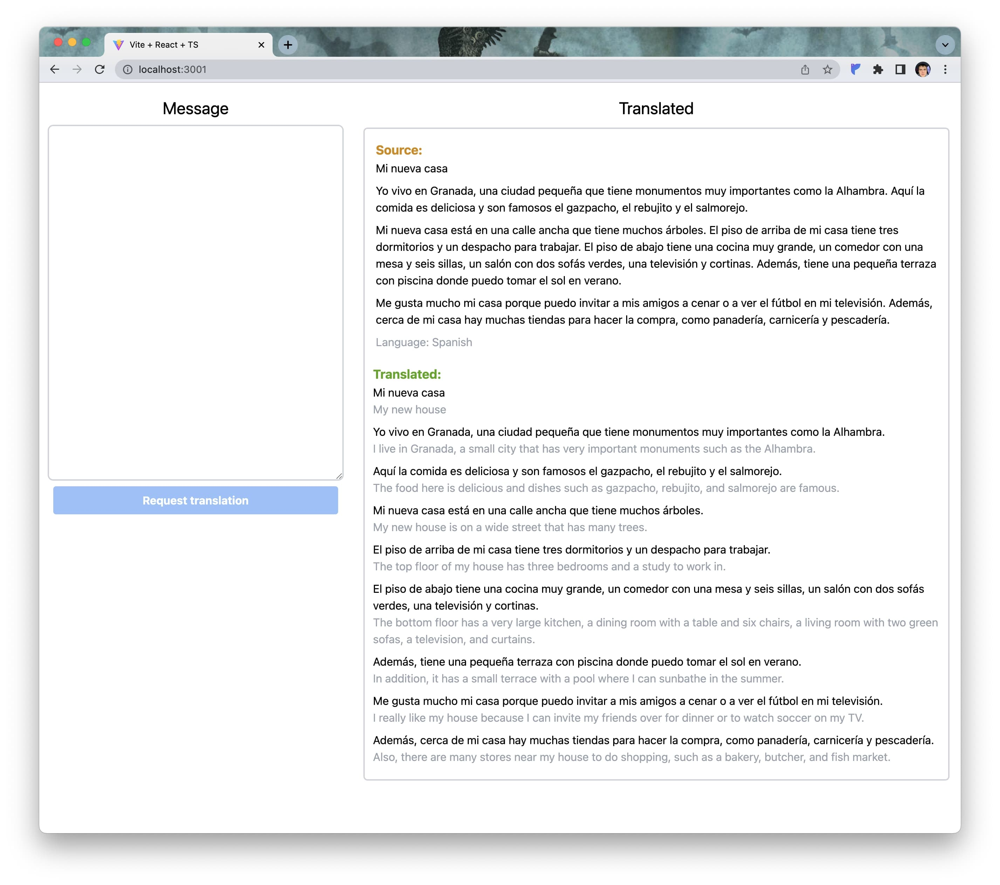

# TranslateByAi

NestJS microservices show case

## Tech Stack

- NestJS
- NATS (Message Broker)
- GraphQL API (CodeFirst)
- Vite+React+TypeScript+Tailwind (Simple Frontend to use API)
- Lerna (Monorepo)

## Description

This is a simple show case of NestJS microservices. It has two microservices:

1. packages\api - GraphQL API microservice
2. packages\ai - translation microservice (uses ChatGPT API)

It works through event-based communication. All messages are non-blocking and are sent through the NATS message broker. There could be multiple instances of the AI microservice, which will be automatically load balanced by NATS using a queue.

## How to run

1. npm run start:nats-server
2. npm run start:dev

- Front end will be available at http://localhost:3001
- GraphqlAPI will be available at http://localhost:3000/graphql

## Screenshots

